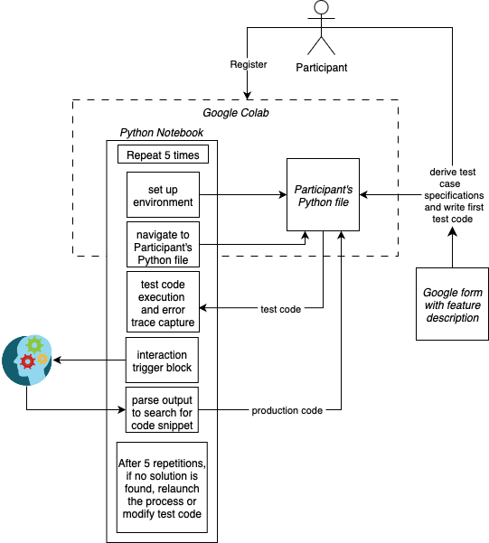

This is the repository for the Python toolset used in the paper:

*Title*: Exploring AI-Developer Interactions in Software Development: A Case Study with Test-Driven Development

*Authors*: Moritz Mock and Barbara Russo

*Note*: This work builds on our prior work *Generative AI for Test Driven Development: Preliminary Results* published in the 1st Workshop on AI for Agile Software Engineering (AI4ASE) @ Agile Software Development (XP'24) - available under the following link: [doi.org/10.1007/978-3-031-72781-8_3](https://doi.org/10.1007/978-3-031-72781-8_3)

The repository contains the following folders:

- [environment](environment) - Contains the code to conduct the experiments, a detailed description can be found below.
- [experiments](experiments) - Contains the submitted code of the participants as well as the collected logs.
  - [evaluation](experiments/evaluation) - Contains the code which is used for the evaluation of the submitted production code of all the observations (P1-P16 and F1).
- [questionnaires](questionnaires) - Contains the questionnaires which we leveraged for collecting the demographics before the experiment and the feedback after the experiment from the 16 participants.
- [responses](responses) - Contains the responses from the 16 participants.

## environment

The **environment** folder contains two Python notebook along with its related code in the folder **ai4tdd-exp**.
The notebook **AI4TDD_Experiment.ipynb**, has four main blocks:
- **Developer Identification**: Authenticates the developer and sets the API key for AI interaction.
- **Environment Setup**: Installs dependencies and prepares the runtime environment.
- **Execution**: Runs `runner.py, which triggers the desired experiment.
- **Output Saving**: Saves the experiment results.

The notebook is an export of the Google Colab notebook that has been used to remotely run the experiments of the paper. The current version of the notebook is meant to be used locally, however, there are instructions on how to use it with Google Colab.

The notebook **AI4TDD_FullyAutomated.ipynb**, has five main blocks:
- **Developer Identification**: Authenticates the developer and sets the API key for AI interaction.
- **Environment Setup**: Installs dependencies and prepares the runtime environment.
- **Execution; test code generation**: Runs `runner.py, which triggers the generation of the test code.
- **Execution; production code generation**: Runs `runner.py, which triggers the generation of the production code.
- **Output Saving**: Saves the experiment results.

The setup of the code requires `python >=12`:

First a new python environment is created:
```commandline
cd environment
python -m venv env
source env/bin/activate
```
Installation of the packages `jupyter notebook` and `openai`:
```commandline
pip install openai notebook
```
Starting the jupiter notebook server:
```commandline
jupyter notebook
```

Below is an illustration of the toolset—specifically, the Jupyter Notebook—used to conduct the experiments with the 16 participants. It shows the notebook within Google Colab, which the participants interacted with, along with a breakdown of the steps they followed during the experiment.



### ai4tdd-exp 

This folder contains the Python code that is used by the notebook. It contains the following files
- **runner.py**: This file contains the code to start one of the two runners.
- **LogRunner.py**: This file contains the runner which handles the saving of the logs for the traditional TDD.
- **CollaborativeTDDRunner.py**: This file contains the runner which handles the interaction with the AI for the collaborative TDD.
- **FullyAutomatedTDDRunner.py**: This file contains the runner which handles the in interaction with the AI for the full automated TDD.
- **LogCollector.py**: This file contains the code which executes the test cases and collects the error traces. Furthermore, **DeveloperAIHandler.py** and **TestCodeAIHandler.py** leverage this code for the automatic execution of test code.
- **DeveloperAIHandler.py**: This file contains the code to interact with the AI, in which the AI will generate the production code.
- **TestCodeAIHandler.py**: This file contains the code to interact with the AI, in which the AI will generate the test code.
- **AIHandler.py**: This file contains the code for the interaction with the AI, which is shared among the **DeveloperAIHandler.py** and **TestCodeAIHandler.py**
- **utils.py**: This file contains the utility functions which are shared among different classes.
- **experiment.py**: This file was given the participants as a starting point for them to write their code.

<!--

## questionnaires

The **questionnaires** folder contains the questionnaires which we leveraged for collecting the demographics before the experiment and the feedback after the experiment from the 16 participants.

## experiments

The **experiments** folder contains the source code collected from the 16 participants, including all the logs and which have been leveraged for the evaluation. 

## Category Partition Testing

The folder **category partition testing** contained the code to run the produced code from the participants 
against the test cases created by us. The folder contains a single python script which automatically executes all the submissions of the 16 participants. 

-->

